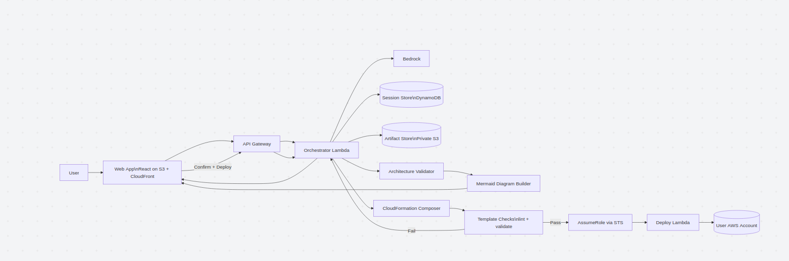

# Cloud Weaver


Cloud Weaver is an AWS architecture assistant that converts a plain-English idea into a validated architecture design.

It supports a full architecture workflow:
- prompt-to-diagram generation (Mermaid)
- rule-based validation (syntax + architecture constraints)
- session-aware context for multi-turn refinement
- optional CloudFormation generation after approval

## Live endpoints

- Frontend (CloudFront): https://d2k45vy1qt3ioe.cloudfront.net/
  - Website has been shutdown due to Hackathon ending
- Backend (API Gateway WebSocket): wss://9vihcpxj86.execute-api.us-west-2.amazonaws.com/dev/

## Table of contents

- [What this project does](#what-this-project-does)
- [End-to-end flow](#end-to-end-flow)
- [System architecture](#system-architecture)
- [AWS services users can design with](#aws-services-users-can-design-with)
- [AWS services used to build this application](#aws-services-used-to-build-this-application)
- [Validation pipeline](#validation-pipeline)
- [Session memory model](#session-memory-model)
- [Repository layout](#repository-layout)
- [Getting started](#getting-started)
- [Configuration](#configuration)
- [Current project focus](#current-project-focus)

## What this project does

Cloud Weaver helps teams quickly go from idea to deployable architecture artifacts while keeping output constrained to an approved AWS service set.

Primary outputs:
- Mermaid architecture diagram text (rendered in frontend)
- architecture reasoning/explanations
- CloudFormation YAML draft generated from approved architecture context

## End-to-end flow

1. A user submits a system idea in the frontend chat UI.
2. The frontend sends the request over API Gateway WebSocket routes.
3. Lambda orchestrates prompt construction and model invocation.
4. Amazon Bedrock returns architecture reasoning + Mermaid graph.
5. Backend validators enforce Mermaid syntax and architecture constraints.
6. Validated output is returned to the frontend for rendering.
7. If approved, CloudFormation generation is requested using the latest session context.
8. CloudFormation output is syntax-validated before deployment-oriented workflows continue.

## System architecture

### Frontend
- React + Vite chat application
- WebSocket client for low-latency request/response flow
- Markdown + Mermaid rendering for assistant output

### Backend
- Python Lambda handlers for orchestration
- Bedrock integration for generation
- DynamoDB-backed session/message persistence
- Validation modules for Mermaid and CloudFormation outputs

### Validation layer
- Mermaid syntax validation
- Architecture rule validation
- CloudFormation YAML structure/syntax validation

## AWS services users can design with

7 Predefined selectable services for generated architectures:

- Amazon Bedrock
- AWS Lambda
- Amazon S3
- API Gateway
- CloudFront
- DynamoDB
- AWS IAM

## AWS services used to build this application



These services power Cloud Weaver itself:

| Service | Role in this project | Notes |
| --- | --- | --- |
| API Gateway (WebSocket) | Real-time transport between frontend and backend | Handles bidirectional chat traffic |
| AWS Lambda | Prompt handling, orchestration, validation pipeline, and response routing | Backend compute layer |
| Amazon Bedrock | Model inference for diagram and CloudFormation generation | Generates architecture output |
| DynamoDB | Persistent conversation memory and session state | Sessions table: `Sessions`<br>Messages table: `Messages`<br>TTL attribute: `expiresAt` |
| Amazon S3 | Frontend artifact hosting and prompt sync target during deploy | Static assets and deployment sync |
| CloudFront | Frontend CDN distribution and cache invalidation | Public frontend delivery |
| CloudFormation | Infrastructure-as-code output target | Template generation path |
| IAM | Execution and deployment permissions | Policies for runtime and deployment |
| STS | Identity checks and temporary credentials in deployment workflows | Temporary role/session credentials |

## Validation pipeline

Validation is separated to reduce invalid model output before deployment actions:

- `validation/mermaid_syntax.py`
	- header and structural checks
	- quote/delimiter balance checks
- `validation/architecture_rules.py`
	- approved service enforcement
	- connection integrity and duplicate/orphan checks
- `validation/cloudformation_syntax.py`
	- YAML syntax checks
	- root object/resource structure checks

## Session memory model

Cloud Weaver uses `sessionID` for multi-turn session continuity.

- Frontend stores `sessionID` in browser localStorage.
- Backend loads recent session history from DynamoDB and injects it into prompt context.
- CloudFormation generation references the latest approved architecture context from the same session.

Current Lambda environment values:

- `CHAT_HISTORY_LIMIT=20`
- `MESSAGES_TABLE=Messages`
- `SESSION_TABLE=Sessions`
- `SESSION_TTL_SECONDS=604800`

Note: backend supports both `SESSION_TABLE` and `SESSIONS_TABLE` variable names.

## Repository layout

```text
aws-architect/
├── backend/
│   ├── lambda/
│   │   ├── handler.py
│   │   ├── bedrock_client.py
│   │   ├── session_store.py
│   │   └── test_local.py
│   ├── validation/
│   │   ├── architecture_rules.py
│   │   ├── mermaid_syntax.py
│   │   └── cloudformation_syntax.py
│   └── requirements.txt
├── frontend/
│   ├── src/
│   │   ├── App.jsx
│   │   ├── MermaidChart.jsx
│   │   └── components/
│   └── package.json
└── prompts/
```

## Getting started

### Prerequisites

- Node.js 20+
- Python 3.12
- AWS credentials configured locally (for backend Bedrock/AWS calls)

### Frontend setup

```bash
cd frontend
npm install
npm run dev
```

Optional clean reinstall after dependency drift:

```bash
cd frontend
rm -rf node_modules
npm ci
```

### Backend setup

```bash
cd backend
python3.12 -m venv .venv
source .venv/bin/activate
python -m pip install --upgrade pip
python -m pip install -r requirements.txt
```

Optional local harness:

```bash
cd backend/lambda
python3 test_local.py
```

## Configuration

Frontend runtime configuration (typically in `.env` under `frontend/`):
- `VITE_WS_URL` for WebSocket backend endpoint
- `VITE_TEST_MODE=true` for local fallback behavior

Backend configuration relies on Lambda environment variables and AWS IAM permissions for Bedrock, DynamoDB, and API integrations.
